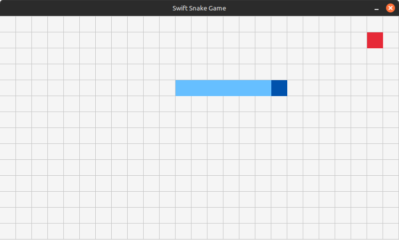

# Swift Snake Game

A simple clone of the classic Snake game written in Swift using [Raylib](https://www.raylib.com/) for graphics.
Created for learning and experimenting with Swift game development on Linux.



---

## Getting Started

### Requirements

- Swift 6.1 or newer
- Raylib (automatically installed via SwiftPM)

### Build & Run

```bash
git clone https://github.com/greebamax/swift-snake-game
cd swift-snake-game
swift build
swift run
```

> [!NOTE]
> If you're running on Linux, make sure required Raylib native libraries are available.

On Ubuntu:

```sh
sudo apt install libraylib-dev libglfw3-dev libopenal-dev libxi-dev libxcursor-dev libxinerama-dev libxrandr-dev
```
